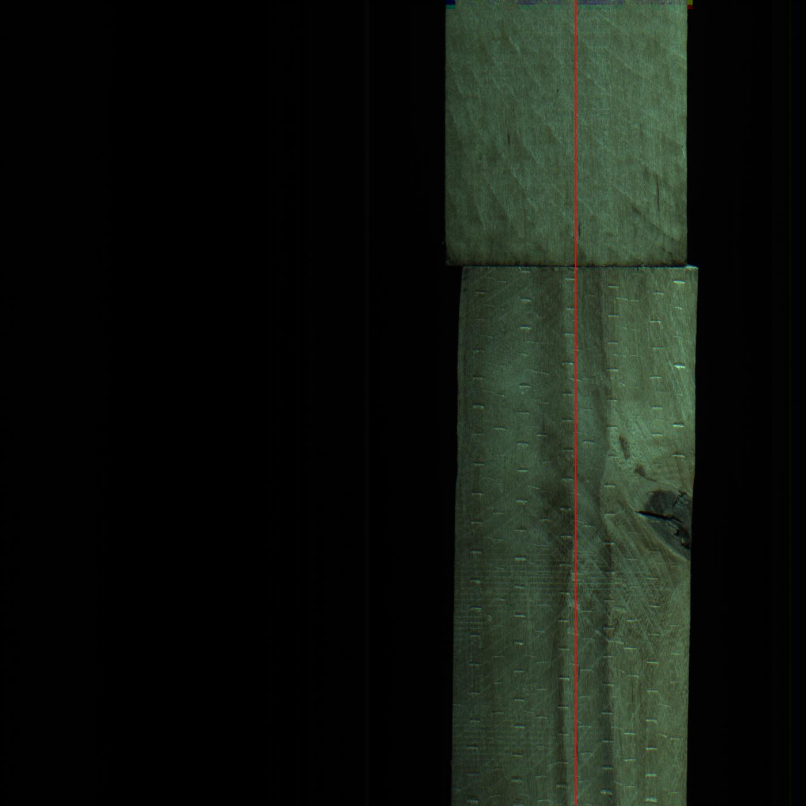
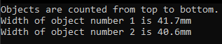

# Katseülesanne

### Leida pildil oleva puulaua laius ning kirjeldada selle tulemuse täpsust.

#### Ühte millimeetrisse mahub täpselt 10 pikslit, ehk 1 piksli kohta on 0,1mm.

## Lahendus

Antud pilte lähemalt uurides lähtun järgnevatest eeldustest:

	* Lauad liiguvad liinil kaamerapildist läbi sirgjooneliselt või ligilähedaselt
	* Lauad on piisavalt pikad, et kaamerapilti mahub maksimaalselt kaks lauda
	* Lauad asuvad kaamerapildis enam-vähem sama kohapeal
	* Laudu ümbritseva piirkonna müra on väikene ehk pikslid on üldiselt väga tuhmid

1. Esmalt valin **algkolonni** ehk asukoha, mis kattub puulaudadega ja on nende suhtes võimalikult keskel.
Nende kahe pildi alusel võtsin selleks 1000 piksli kauguse pildi vasakust äärest:

2. Valitud kolonnist otsin pikslite **valgustugevuse väärtust** kuniks leian ühe, mis on alla ette antud piirväärtuse ehk piisavalt tuhm.
Selle leidmisel kontrollin ka järgmise piksli ning sellega ühes reas olevate pikslite väärtust, et vältida oksakohti või muid anomaaliaid.

3. Järgmise rea kõrvaliste pikslite kauguse valimine:
	- Väiksema kauguse peaks valima, kui lauad on pildi suhtes viltu
	- Suurem kaugus ignoreerib paremini anomaaliaid ja kiirendab programmi käiku

4. Kui mõnel pildil algkolonn ei kattu puulaudadega või anomaaliaid on palju ehk leitakse rohkem kui üks eralduskoht,
siis valitakse uus kolonn, mis on eelnevast ette määratud sammu võrra eemal. See otsing kordub mõlemas suunas kuni leitakse kolonn, mis rahuldab tingimusi.
	- Sammud puulaudade tuvastamiseks ja anomaaliate tühistamiseks on erinevad, et nad teineteist ei neutraliseeriks
	- Kui puulauda või eralduskohta ei tuvastata, siis võib vähendada samme ja suurendada sammude hulka

5. Peale eralduskoha leaidmist jaotan puulauad kaheks: pildi ülevast servast eralduskohani ning eralduskohast pildi alumise servani.

6. Leitud puulauadadele kannan **mõõtepunktid**, mille hulka saab eelnevalt valida. Samuti saab valida, mitut punkti kummagist ekstreemumist ei arvestata.
	- Kui puulauadade külgedel on vigastatud kohti (sisse lõikeid, mädanikku, vms), siis tasub valida rohkem mõõtepunkte ja eemaldada rohkem ekstreemumeid.
	
7. Kui ekstreemväärtused on eemaldatud, siis võtan ülejäänud mõõtepunktide keskmise ning teisendan selle millimeetritesse. Kordan sama järgneva puulaua puhul.

8. Kuna pildil on puulaudade ja tausta pikslite valgustugevus väga erinev, siis vastus peaks tulema päris täpne. Julgeks anda vähemalt 90%, tõenäoliselt täpsem.
	- Kui suurem täpsus on oluline, siis annaks parandada tulemust kontrollides õigete andmetega ning määrates täpse piksli, kust puulaud algab. Praegu võib lauda ümbritsev kuma jääda mõõtetulemusse sisse.
	- Kui see ei ole piisav, siis peaks pilti eelnevalt töötlema serva tuvastuse põhimõtetel (müra vähendamine, must-valgeks tegemine, kontrasti suurendamine, kontuuride hõrendamine, jne)

9. Eelised:
	- Väike arvutusresursi nõudlus
	- Kiire operatsiooniaeg
	- Kui puulaudade servad on terved ja ei ole kalde all, siis peaks saama päris täpse tulemuse
	- Täpsust võimalik parandada muutujate väärtuste valimisega

10. Puudused:
	- Skaleeritavus ehk kui oleks rohkem infot vaja puulaudadest (pindala koos deformatsioonidega vms), siis oleks tõenäoliselt mõistlikum teha kohe lahendus üldise piirituvastusega.
	- Kui lauad peaksid tulema suure nurga all, siis sellega programm ei arvesta
	- Suurte defektide puhul annab samuti tõenäoliselt vale tulemuse, kui piisavalt ekstreemumeid ei eirata
	- Ei võimalda tuvastada laiusi, kui piltidele võib sattuda üle kahe laua

## Vastus

Tulemuse ümardan 0.1mm täpsusega.

Pildi "Image__2019-11-29__13-43-06.bmp" puhul sain puulaudade laiused järgnevad:
- Esimese puulaua laius on 41.7mm
- Teise puulaua laius on 40.6mm

